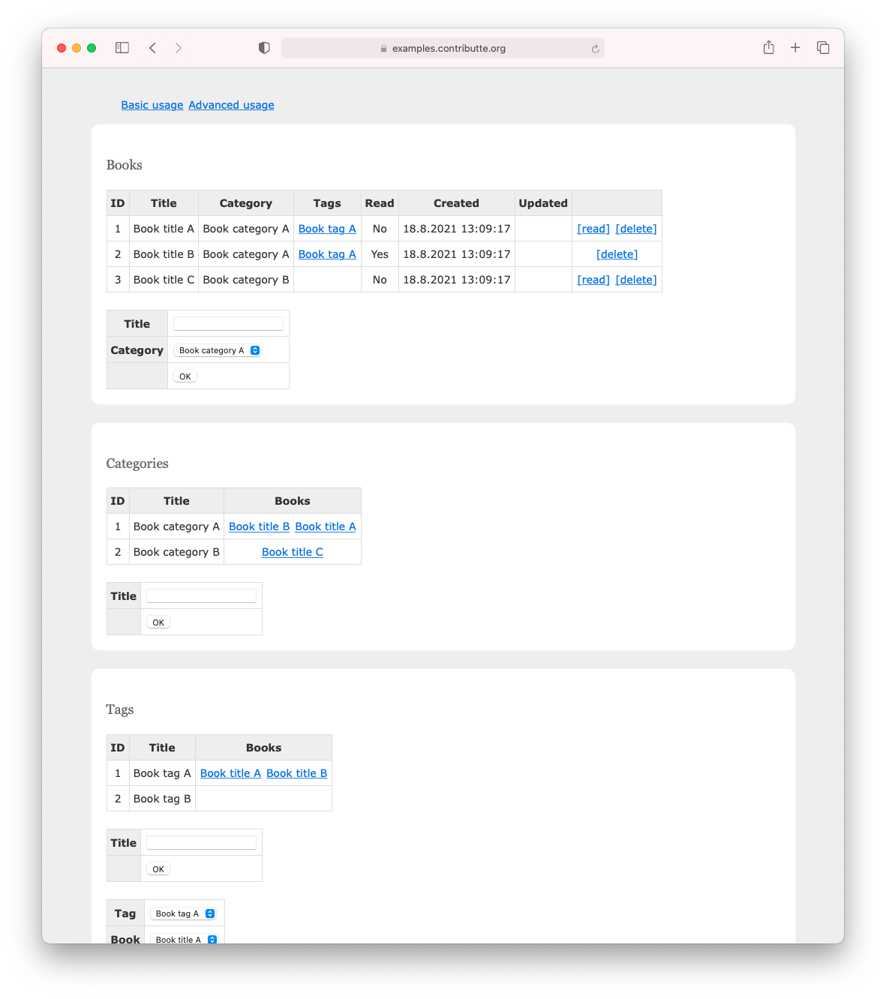

<p align=center>
  <a href="https://github.com/contributte/doctrine-skeleton/actions"></a>
  <a href="https://coveralls.io/r/contributte/doctrine-skeleton"></a>
  <a href="https://packagist.org/packages/contributte/doctrine-skeleton"></a>
  <a href="https://packagist.org/packages/contributte/doctrine-skeleton"></a>
</p>
<p align=center>
  <a href="https://packagist.org/packages/contributte/doctrine-skeleton"></a>
  <a href="https://github.com/contributte/doctrine-skeleton"></a>
  <a href="https://bit.ly/ctteg"></a>
  <a href="https://bit.ly/cttfo"></a>
  <a href="https://contributte.org/partners.html"></a>
</p>

<p align=center>
Website 🚀 <a href="https://contributte.org">contributte.org</a> | Contact 👨🏻‍💻 <a href="https://f3l1x.io">f3l1x.io</a> | Twitter 🐦 <a href="https://twitter.com/contributte">@contributte</a>
</p>

<p align=center>
    </img>
</p>

-----

## Goal

Main goal is to provide best prepared starter-kit project for Nette developers.

Focused on:

- latest PHP 8.0
- `nette/*` packages
- Doctrine ORM via `nettrine/*`
- Symfony components via `contributte/*`
- codestyle checking via **CodeSniffer** and `ninjify/*`
- static analysing via **phpstan**
- unit / integration tests via **Nette Tester** and `ninjify/*`

## Demo

https://examples.contributte.org/doctrine-skeleton/

## Installation

To install latest version of `contributte/doctrine-skeleton` use [Composer](https://getcomposer.org).

```
composer create-project -s dev contributte/doctrine-skeleton acme
```

### Install using [docker](https://github.com/docker/docker/)

1) At first, use composer to install this project.

   ```
   composer create-project -s dev contributte/doctrine-skeleton
   ```

2) After that, you have to setup Postgres >= 12 database. You can start it manually or use docker image `postgres:12`.

   ```
   docker run -it -p 5432:5432 -e POSTGRES_PASSWORD=doctrine -e POSTGRES_USER=doctrine dockette/postgres:12
   ```

   Or use make task, `make docker-postgres`.

3) Custom configuration file is located at `app/config/local.neon`. Edit it if you want.

   Default configuration should look like:

   ```neon
   # Host Config
   parameters:
       # Database
       database:
           host: localhost
           dbname: doctrine
           user: doctrine
           password: doctrine
   ```

4) Ok database is now running and application is configured to connect to it. Let's create initial data.

   Run `NETTE_DEBUG=1 bin/console migrations:migrate` to create tables. Run `NETTE_DEBUG=1 bin/console doctrine:fixtures:load --append` to create first user(s).

   Or via task `make build`.

5) Start your devstack or use PHP local development server.

   You can start PHP server by running `php -S localhost:8000 -t www` or use prepared make task `make dev`.

6) Open http://localhost:8000 and enjoy!

### Composer packages

Take a detailed look :eyes: at each single package.

- [contributte/bootstrap](https://contributte.org/packages/contributte/bootstrap.html)
- [contributte/application](https://contributte.org/packages/contributte/application.html)
- [contributte/di](https://contributte.org/packages/contributte/di.html)
- [contributte/cache](https://contributte.org/packages/contributte/cache.html)
- [contributte/http](https://contributte.org/packages/contributte/http.html)
- [contributte/forms](https://contributte.org/packages/contributte/forms.html)
- [contributte/mail](https://contributte.org/packages/contributte/mail.html)
- [contributte/security](https://contributte.org/packages/contributte/security.html)
- [contributte/utils](https://contributte.org/packages/contributte/utils.html)
- [contributte/latte](https://contributte.org/packages/contributte/latte.html)
- [contributte/tracy](https://contributte.org/packages/contributte/tracy.html)
- [contributte/console](https://contributte.org/packages/contributte/console.html)
- [contributte/translation](https://contributte.org/packages/contributte/translation.html)
- [contributte/neonizer](https://contributte.org/packages/contributte/neonizer.html)

**Doctrine**

- [contributte/doctrine-orm](https://contributte.org/packages/contributte/doctrine-orm.html)
- [contributte/doctrine-dbal](https://contributte.org/packages/contributte/doctrine-dbal.html)
- [contributte/doctrine-migrations](https://contributte.org/packages/contributte/doctrine-migrations.html)
- [contributte/doctrine-fixtures](https://contributte.org/packages/contributte/doctrine-fixtures.html)
- [contributte/doctrine-extensions-atlantic18](https://contributte.org/packages/contributte/doctrine-extensions-atlantic18.html)

**Dev**

- [contributte/dev](https://contributte.org/packages/contributte/dev.html)
- [ninjify/qa](https://contributte.org/packages/ninjify/qa.html)
- [ninjify/nunjuck](https://contributte.org/packages/ninjify/nunjuck.html)
- [phpstan/phpstan](https://github.com/phpstan/phpstan)

## Screenshots



## Development

See [how to contribute](https://contributte.org/contributing.html) to this package.

This package is currently maintaining by these authors.

<a href="https://github.com/f3l1x">
    
</a>
<a href="https://github.com/petrparolek">
  
</a>

-----

Consider to [support](https://contributte.org/partners.html) **contributte** development team. Also thank you for using this project.
